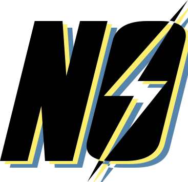

 

  
  <h3 align="center">Nukout</h3>
  
You are currently reading the repository documentation, happy reading :)

 

# Nukout Official Repository
Nukout is a gaming and versatile Discord bot designed to play on Discord has a shelter manager! Inspired by the famous game: Fallout Shelter, create your abi, manage it, produce it and become the best supervisor of Nukout-Tech

 

# Installation
Nukout is not currently online, it is being created

 

# Support and Feedback
There is currently no Support server available.

### Thank you for Nukout as your Discord bot ! We hope it brings joy and excitement to your server.